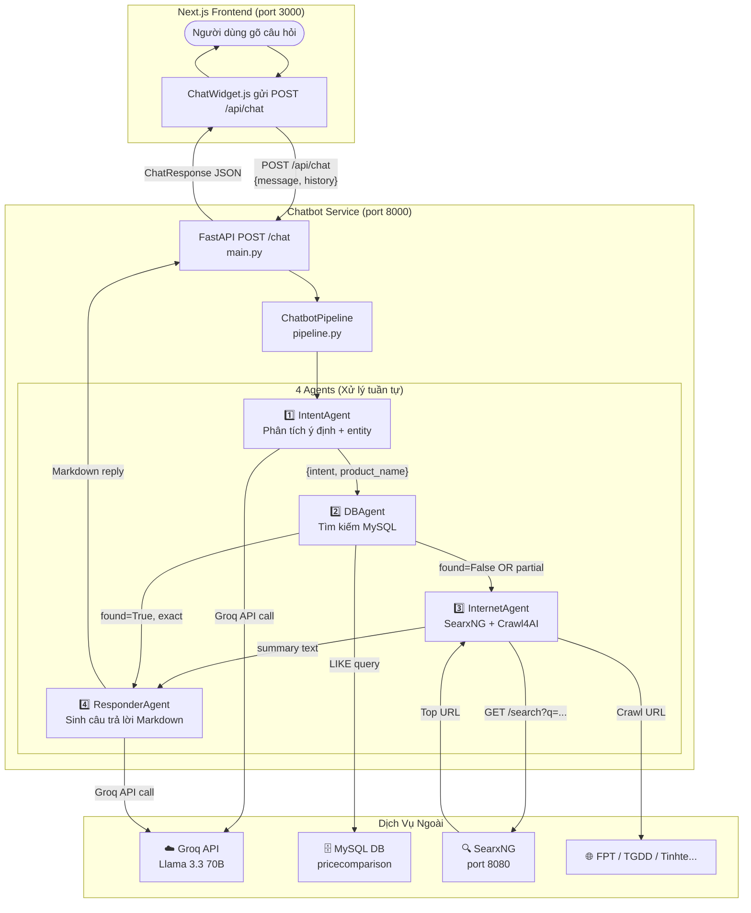

# Tài Liệu Kỹ Thuật: PriceHawk Chatbot Service

> **Dành cho:** Developer mới join team, chưa biết gì về service này.  
> **Mục tiêu:** Đọc xong là tự debug, mở rộng và deploy được — không cần hỏi thêm.

---

## Mục Lục

1. [Chatbot Service Là Gì?](#1-chatbot-service-là-gì)
2. [Các Thành Phần Bên Trong Service](#2-các-thành-phần-bên-trong-service)
3. [Luồng Xử Lý Chi Tiết (Step by Step)](#3-luồng-xử-lý-chi-tiết-step-by-step)
4. [Các Loại Intent và Cách Xử Lý](#4-các-loại-intent-và-cách-xử-lý)
5. [Edge Cases và Known Issues](#5-edge-cases-và-known-issues)
6. [Retry Logic và Fallback](#6-retry-logic-và-fallback)
7. [Debug Info — Cách Đọc Logs](#7-debug-info--cách-đọc-logs)

---

## 1. Chatbot Service Là Gì?

### 1.1. Nhiệm Vụ Duy Nhất

Chatbot Service là một **microservice Python độc lập** hoạt động song song với Next.js frontend. Nó **không** làm nhiệm vụ crawl data, không render UI, không quản lý user.

Nhiệm vụ duy nhất:  
**Nhận câu hỏi tự nhiên → Hiểu ý định → Tìm giá trong DB/Internet → Trả lời tiếng Việt thân thiện.**

Khi người dùng gõ "iPhone 15 giá bao nhiêu?" trong khung chat, toàn bộ chuỗi xử lý sau đây xảy ra ẩn sau màn hình trong khoảng **2–12 giây**:

```
User Input → IntentAgent → DBAgent → [InternetAgent] → ResponderAgent → Markdown Reply
```

### 1.2. Công Nghệ Sử Dụng

| Tầng | Công Nghệ | Chi Tiết |
|---|---|---|
| **Web Framework** | FastAPI | Async, Pydantic validation, Swagger tự động |
| **LLM (AI)** | Groq Cloud API | Model chính: `llama-3.3-70b-versatile`; Dự phòng: `llama-3.1-8b-instant` |
| **Database** | MySQL 8.0 | Dùng `pymysql` + `DBUtils.PooledDB` (connection pool, tối đa 10 kết nối) |
| **Internet Search** | SearxNG (self-hosted) | Meta-search engine chạy tại `http://searxng:8080` trong Docker network |
| **Web Scraping** | Crawl4AI | Async headless crawler, trả về Markdown text từ trang web |
| **ASGI Server** | Uvicorn | Chạy service tại port `8000` |

### 1.3. Sơ Đồ Luồng Tổng Thể



---

## 2. Các Thành Phần Bên Trong Service

### 2.1. Cấu Trúc Thư Mục

```
chatbot/
├── main.py               ← FastAPI app, routes, request/response schema
├── pipeline.py           ← Orchestrator điều phối 4 agents
├── db.py                 ← Kết nối MySQL, search_products(), group_by_product()
├── agents/
│   ├── __init__.py
│   ├── intent_agent.py   ← Agent 1: NLP phân tích intent
│   ├── db_agent.py       ← Agent 2: Tìm kiếm MySQL qua db.py
│   ├── internet_agent.py ← Agent 3: SearxNG + Crawl4AI + tóm tắt
│   └── responder_agent.py← Agent 4: Sinh câu trả lời cuối cùng
├── Dockerfile
├── requirements.txt
└── .env.docker           ← Biến môi trường khi chạy trong Docker
```

---

### 2.2. Agent 1 — IntentAgent (`intent_agent.py`)

**Chức năng:** Phân tích câu hỏi tự nhiên để trả về intent + tên sản phẩm đã làm sạch.

**Model LLM:**
```python
MODEL_PRIMARY  = "llama-3.3-70b-versatile"   # Chạy chính
MODEL_FALLBACK = "llama-3.1-8b-instant"       # Khi primary bị 429 Rate Limit
```

**System Prompt (Trích nguyên văn từ code):**
```
Bạn là assistant phân tích câu hỏi trên website so sánh giá điện thoại, laptop và tablet tại Việt Nam.
...
- "price_query": hỏi giá, nơi mua, cửa hàng rẻ nhất
- "compare": so sánh 2+ sản phẩm
- "review_query": hỏi thông số, review, đánh giá, nên mua không
- "out_of_scope": liên quan đến điện tử nhưng ngoài khả năng (bảo hành, sửa chữa, phụ kiện)
- "irrelevant": hoàn toàn không liên quan (thời tiết, ẩm thực, bóng đá)

QUAN TRỌNG: product_name chỉ gồm tên thương hiệu + model, KHÔNG bao gồm từ hỏi.
Trả về JSON thuần túy, không có markdown.
```

**Conversation Context:** IntentAgent **nhận tối đa 2 lượt chat gần nhất** từ `history` để hiểu ngữ cảnh hội thoại (VD: câu hỏi follow-up "Còn bảo hành bao lâu?" sau khi đã nhắc đến iPhone 15).

**Output Format (Strict JSON):**
```json
{
  "intent": "price_query",
  "product_name": "Samsung Galaxy S24 Ultra",
  "product_name_2": null,
  "brand": "samsung",
  "category": "dien-thoai"
}
```

**Cơ Chế JSON Extraction (`_extract_json`):**  
LLM đôi khi bọc kết quả trong code fence markdown. Hàm `_extract_json` có 3 tầng parse:
1. Parse trực tiếp `json.loads(text.strip())`
2. Nếu lỗi: dùng regex tìm ```json ... ```
3. Nếu vẫn lỗi: dùng regex tìm `{...}` bất kỳ

**Regex Fallback (`_fallback_extract`):**  
Khi cả 2 model Groq đều sập (network error, quota hết):
```python
noise = ["giá bao nhiêu?", "bao nhiêu tiền?", "review", "đánh giá", ...]
# → Xóa hết các từ hỏi, giữ lại phần tên sản phẩm tương đối
```
Trường hợp này, intent mặc định là `"price_query"`.

---

### 2.3. Agent 2 — DBAgent (`db_agent.py` + `db.py`)

**Chức năng:** Tìm kiếm sản phẩm trong MySQL database của hệ thống.

**Cơ Chế Phát Hiện Category (`detect_category_from_query`):**  
Trước khi search, DBAgent đoán category từ tên sản phẩm qua từ điển cứng:

```python
CATEGORY_HINTS = {
    "dien-thoai": ["iphone", "samsung", "xiaomi", "oppo", "galaxy s", ...],
    "laptop":     ["macbook", "dell", "hp", "asus", "lenovo", "thinkpad", ...],
    "tablet":     ["ipad", "galaxy tab", "máy tính bảng", ...],
}
```

**Thuật Toán Tìm Kiếm (trong `db.py → search_products()`):**

Tìm kiếm hoạt động qua **2 pass**:

*Pass 1 — LIKE search toàn câu:*
```sql
SELECT p.id, p.name, p.brand, c.name AS retailer, c.price, c.url AS retailer_url
FROM product p
JOIN comparison c ON p.id = c.product_id
WHERE p.name LIKE %keyword%
ORDER BY c.price ASC
LIMIT 50
```

*Pass 2 — Nếu Pass 1 rỗng, tách từ khóa thành các từ quan trọng (loại bỏ stopwords) và LIKE từng từ:*
```python
stopwords = {"giá", "bao", "mua", "tốt", "review", "rẻ", ...}
meaningful = [w for w in words if len(w) > 2 and w.lower() not in stopwords]
# Sort: ưu tiên từ có chữ số (S24, M3, 15) và chữ hoa (Pro, Max, Ultra)
```

**Thuật Toán Chấm Điểm Tương Đồng (`check_similarity`):**  
Sau khi có tập candidate từ DB, hàm `check_similarity` tính điểm cho mỗi sản phẩm:

```python
# 1. Bỏ dấu tiếng Việt (normalize)
q_norm = _remove_diacritics(query.lower())   # "có tốt không" → "co tot khong"
t_norm = _remove_diacritics(target.lower())

# 2. Tính 2 chỉ số
seq_ratio  = SequenceMatcher(q_norm, t_norm).ratio()   # Giống nhau theo chuỗi ký tự
word_overlap = len(q_words ∩ t_words) / len(q_words)  # % từ của query có trong tên SP

# 3. Trọng số cuối
score = (seq_ratio * 0.4) + (word_overlap * 0.6)
```

**Phân Loại Kết Quả (Threshold):**

| Điểm | Phân Loại | Ý nghĩa |
|---|---|---|
| `>= 0.85` | `"exact"` | Khớp chính xác → Tin tưởng dùng ngay |
| `>= 0.60` | `"partial"` | Khớp một phần → Cần xác minh bằng Internet |
| `< 0.60` | `"none"` | Không tìm thấy → Fallback toàn bộ sang Internet |

**Output của DBAgent:**
```python
{
    "found": True,
    "products": [
        {
            "id": 42,
            "name": "Samsung Galaxy Tab S9 FE Wifi",
            "brand": "samsung",
            "image_url": "https://...",
            "prices": [
                {"retailer": "fpt", "price": 8810000, "url": "https://fptshop.com.vn/..."},
                {"retailer": "tgdd", "price": 8990000, "url": "https://thegioididong.com/..."},
            ]
        }
    ],
    "search_keyword": "Galaxy Tab S9 FE",
    "match_type": "exact",   # hoặc "partial"
    "db_available": True,
}
```

**Connection Pool:**
```python
_pool = PooledDB(creator=pymysql, maxconnections=10, mincached=2, ...)
```
Pool được khởi tạo **lazy** (lần đầu gọi mới tạo) và dùng chung cho toàn bộ lifetime của service.

---

### 2.4. Agent 3 — InternetAgent (`internet_agent.py`)

**Khi nào được gọi:**
- DB không tìm thấy (`found=False`)
- DB chỉ có `partial` match (muốn verify bằng nguồn thực tế)

**Quy Trình 4 Bước:**

```
keyword → [SearxNG Search] → [Pick Best URL] → [Crawl4AI] → [LLM Summarize]
```

**Bước 1 — SearxNG Search:**
```python
query = f"{keyword} giá thông số đánh giá Việt Nam"
# Gọi: GET http://searxng:8080/search?q={query}&format=json
# Retry: 3 lần, sleep 2s giữa các lần
# Lấy top 5 URL từ kết quả
```

> ⚠️ **Lưu ý Docker Network:** SearxNG chạy trong cùng Docker network `mynetwork`. Địa chỉ phải là `http://searxng:8080` (tên service), không phải `localhost:8080`.

**Bước 2 — Pick Best URL (`_pick_best_url`):**  
Ưu tiên các domain có độ tin cậy cao, theo thứ tự:
```python
priority_domains = [
    "thegioididong.com",   # TGDD — giá chính xác nhất
    "fptshop.com.vn",      # FPT Shop
    "hoanghamobile.com",
    "tinhte.vn",           # Review chất lượng
    "genk.vn",
    "cellphones.com.vn",
    "websosanh.vn",
]
```
Nếu không có domain nào khớp → lấy URL đầu tiên trong kết quả.

**Bước 3 — Crawl4AI:**
```python
config = CrawlerRunConfig(
    word_count_threshold=50,        # Bỏ đoạn văn < 50 từ
    exclude_external_links=True,    # Không theo link ngoài
    remove_overlay_elements=True,   # Xóa popup, cookie banner
)
# Trả về result.markdown (tối đa 5000 ký tự đầu tiên)
```
Crawler được khởi tạo **một lần** và tái sử dụng (singleton `self._crawler`). Nếu crawl lỗi, crawler bị reset về `None` để tạo mới lần sau.

**Bước 4 — LLM Summarize:**
```python
prompt = f"Tóm tắt thông tin về '{keyword}' (tối đa 300 từ). Tập trung: giá, thông số kỹ thuật, ưu/nhược điểm.\n\nNội dung:\n{content}"
```
Dùng cùng cơ chế primary/fallback model như các agent khác.

**Output của InternetAgent:**
```python
# Thành công:
{"found": True,  "summary": "iPhone 15 Pro Max có giá...", "source_url": "https://...", "keyword": "iPhone 15"}

# Thất bại:
{"found": False, "summary": None, "source_url": None, "keyword": "iPhone 15"}
```

---

### 2.5. Agent 4 — ResponderAgent (`responder_agent.py`)

**Chức năng:** "Phát ngôn viên" — nhận data thô và sinh câu trả lời Markdown tiếng Việt.

**3 Nguồn Data Khác Nhau:**

*Nguồn 1: DB (Exact Match)*  
Hàm `reply_from_db(db_result, user_message, intent)` nhận list sản phẩm từ DBAgent. Hàm `_format_product_data()` biến list dict thành text có cấu trúc để đưa vào LLM prompt:
```
[Sản phẩm 1] Samsung Galaxy Tab S9 FE Wifi
  Thương hiệu: samsung
  Giá theo cửa hàng:
    - FPT Shop: 8.810.000đ (https://fptshop.com.vn/...)
    - Thế Giới Di Động: 8.990.000đ (https://thegioididong.com/...)
```

*Nguồn 2: Internet*  
Hàm `reply_from_internet(internet_result, user_message)` dùng trực tiếp chuỗi `summary` từ InternetAgent, kèm lệnh BẮT BUỘC format link nguồn dạng Markdown.

*Nguồn 3: System Template*  
`reply_irrelevant()` và `reply_out_of_scope()` trả về chuỗi template cứng, **không gọi LLM**, nhanh và không tốn quota.

**Prompt Engineering Quan Trọng:**

Với intent `compare`:
```
Hãy vẽ BẢNG SO SÁNH (Markdown Table) side-by-side...
Bảng nên có: RAM, Camera, Pin và Giá ở từng cửa hàng (kèm link mua hàng,
định dạng CHUẨN MARKDOWN: [Tên cửa hàng](url) - TUYỆT ĐỐI KHÔNG CÓ DẤU CÁCH giữa ] và ()
```

Với partial match fallback:
```
LƯU Ý QUAN TRỌNG: Hệ thống KHÔNG tìm thấy chính xác '{product}' mà người dùng yêu cầu,
chỉ tìm thấy sản phẩm tương tự. Hãy LỊCH SỰ XIN LỖI người dùng trước, rồi mới đề xuất.
```

---

## 3. Luồng Xử Lý Chi Tiết (Step by Step)

### Ví dụ Request: `"Có thông tin gì về Galaxy Tab S9 FE không"`

**HTTP Request đến FastAPI:**
```http
POST /chat HTTP/1.1
Content-Type: application/json

{
  "message": "Có thông tin gì về Galaxy Tab S9 FE không",
  "history": []
}
```

---

**Step 1: FastAPI nhận Request**  
`main.py → chat()` validate request bằng Pydantic `ChatRequest`, kiểm tra `pipeline is not None`, rồi gọi `await pipeline.run(message, history)`.

---

**Step 2: IntentAgent phân tích**  
- **Input:** `"Có thông tin gì về Galaxy Tab S9 FE không"`
- **Xử lý:** Gọi Groq API với system prompt + câu hỏi trên.
- **Output:**
  ```json
  {
    "intent": "review_query",
    "product_name": "Galaxy Tab S9 FE",
    "product_name_2": null,
    "brand": "samsung",
    "category": "tablet"
  }
  ```
- **Log:** `[Pipeline] Intent: review_query | Product: Galaxy Tab S9 FE | Category: tablet`

---

**Step 3: DBAgent tìm kiếm**  
- **Input:** keyword=`"Galaxy Tab S9 FE"`, category=`"tablet"`
- **Xử lý:**
  1. `detect_category_from_query` xác nhận category = `"tablet"`
  2. Pass 1: `WHERE p.name LIKE '%Galaxy Tab S9 FE%'` → Tìm thấy rows
  3. `check_similarity("Galaxy Tab S9 FE", "Samsung Galaxy Tab S9 FE Wifi")` → score ≈ 0.88 → `"exact"`
- **Output:**
  ```python
  {
      "found": True, "match_type": "exact",
      "products": [
          {"name": "Samsung Galaxy Tab S9 FE Wifi", "prices": [{"retailer": "fpt", "price": 8810000, ...}]},
          {"name": "Samsung Galaxy Tab S9 FE WiFi 8GB", "prices": [...]},
      ]
  }
  ```
- **Log:** `[DBAgent] Found 2 products (match_type=exact) with 2 price entries`

---

**Step 4: Pipeline quyết định nhánh**  
`match_type == "exact"` → **Nhảy thẳng sang ResponderAgent, bỏ qua InternetAgent.**

---

**Step 5: ResponderAgent sinh câu trả lời**  
- **Input:** `db_result` (2 sản phẩm, giá FPT), `intent="review_query"`
- **Xử lý:** `_format_product_data()` chuyển data sang text, gọi Groq với prompt tổng hợp.
- **Output (Markdown):**
  ```markdown
  Samsung Galaxy Tab S9 FE có 2 phiên bản tại hệ thống:

  | Sản phẩm | FPT Shop |
  |---|---|
  | Galaxy Tab S9 FE Wifi | [8.810.000đ](https://fptshop.com.vn/...) |
  | Galaxy Tab S9 FE Wifi 8GB | [8.990.000đ](https://fptshop.com.vn/...) |

  💡 **Gợi ý:** Phiên bản Wifi cơ bản tại [FPT Shop](https://...) có giá rẻ nhất.
  ```
- **Log:** `[Pipeline] Done. Source: database | Latency: 2350.2ms`

---

**HTTP Response về Frontend:**
```json
{
  "reply": "Samsung Galaxy Tab S9 FE có 2 phiên bản...",
  "source": "database",
  "products": [{"retailer": "fpt", "price": 8810000, "url": "https://..."}],
  "intent": "review_query",
  "search_keyword": "Galaxy Tab S9 FE",
  "latency_ms": 2350.2
}
```

---

## 4. Các Loại Intent và Cách Xử Lý

### Bảng Tổng Hợp

| Intent | Ví Dụ Input Thực Tế | Pipeline | Output Đặc Trưng |
|---|---|---|---|
| `price_query` | "Giá iPhone 15 Pro Max 256GB là bao nhiêu?" | Intent → DB → (Web) → Responder | Bảng giá, link mua hàng màu xanh, gợi ý chỗ rẻ nhất |
| `review_query` | "Có thông tin gì về Galaxy Tab S9 FE không" | Intent → DB → (Web) → Responder | Tóm tắt thông số + bảng giá |
| `compare` | "So sánh s24 ultra và ip 15 pro max" | Intent → **DB tìm cả 2 SP** → Responder | Markdown Table so sánh side-by-side |
| `out_of_scope` | "Sửa màn hình iPhone 15 bao nhiêu?" | Intent → System Reply | Template cứng, không gọi LLM |
| `irrelevant` | "Hôm nay trời có mưa không?" | Intent → System Reply | Template cứng, không gọi LLM |

---

### Chi Tiết: Intent `compare`

Pipeline có nhánh riêng cho `compare`:
```python
if intent == INTENT_COMPARE and product_name_2:
    db_result_2 = await self.db_agent.run(product_name_2, category)
    # Gộp 2 kết quả vào 1 db_result
    db_result["products"] = db_result["products"] + db_result_2["products"]
    db_result["search_keyword"] = f"{product_name} & {product_name_2}"
```
ResponderAgent nhận được **list sản phẩm hỗn hợp** và tự sinh bảng so sánh 2 bên.

---

### Chi Tiết: Intent `irrelevant` vs `out_of_scope`

```python
# irrelevant: Hoàn toàn không liên quan
IRRELEVANT_REPLY = "Xin chào! Mình là trợ lý so sánh giá của PriceHawk 🦅\n\n..."

# out_of_scope: Liên quan điện tử nhưng ngoài khả năng (bảo hành, sửa chữa)
OUT_OF_SCOPE_REPLY = "Câu hỏi này nằm ngoài phạm vi mình có thể hỗ trợ 😅\n\n..."
```

Cả hai đều **không gọi LLM**, không gọi DB, trả về ngay lập tức (latency < 50ms).

---

## 5. Edge Cases và Known Issues

### Issue #1: Partial Match Trả Về Sản Phẩm Sai

**Tình huống:**  
User hỏi "Xiaomi 14 Ultra" → DB không có sản phẩm này → Pass 2 (LIKE từng từ) match được "Xiaomi Redmi Note 14" → Score đủ `partial` threshold → DB trả về Redmi Note 14 thay vì báo không tìm thấy.

**Cách xử lý hiện tại:**  
```python
# pipeline.py — khi DB chỉ có partial, ưu tiên Internet trước
if db_match_type == "partial":
    print("DB partial match → trying Internet first for accuracy...")
    internet_result = await self.internet_agent.run(db_keyword)
    if internet_result["found"]:
        return responder.reply_from_internet(internet_result, ...)  # Dùng data web
    # Nếu web cũng fail → mới dùng partial DB, nhưng thêm cờ
    db_result["partial_fallback"] = True
```

Khi `partial_fallback=True`, ResponderAgent được dặn dò đặc biệt:
```
LƯU Ý QUAN TRỌNG: Hệ thống KHÔNG tìm thấy chính xác 'Xiaomi 14 Ultra'.
Hãy LỊCH SỰ XIN LỖI người dùng trước, sau đó mới đề xuất sản phẩm tương tự.
```

**Hướng fix tương lai:**  
Thay `LIKE` bằng **Vector Embeddings** (Elasticsearch hoặc PgVector). So sánh embedding của query với embedding của tên sản phẩm → kết quả gần nghĩa hơn, không bị lầm do trùng từ.

---

### Issue #2: "Exact Match" Thực Ra Không Exact

**Tình huống:**  
User hỏi "Samsung S24" → Pass 1 LIKE tìm thấy "Samsung Galaxy S24 FE". Khi chạy `check_similarity`:
- `q_norm = "samsung s24"`, `t_norm = "samsung galaxy s24 fe"`  
- `word_overlap = {samsung, s24} ∩ {samsung, galaxy, s24, fe} / 2 từ = 1.0` → Điểm rất cao → Gắn nhãn `"exact"` → Bot nói giá S24 FE thay vì S24 thường.

**Nguyên nhân gốc:**  
Hàm `check_similarity` không phân biệt được "từ thừa" trong tên sản phẩm. "FE" là variant khác hẳn về giá (rẻ hơn ~5 triệu) nhưng lại bị score cao vì query hoàn toàn là subset của tên sản phẩm.

**Hướng fix tương lai:**  
Thêm penalty vào score nếu tên sản phẩm có **nhiều hơn N từ so với query** (VD: nếu query 2 từ mà target 5 từ thì nhân 0.7x).

---

### Issue #3: Teencode/Viết Tắt Không Được Nhận Diện

**Tình huống:**  
"sam xun rách dâu 5" (= Samsung Galaxy Z Fold 5) → IntentAgent trả về `"intent": "irrelevant"` → Pipeline trả về template xin lỗi thay vì tìm sản phẩm.

**Cách xử lý hiện tại:**  
Không xử lý — đây là behavior có chủ đích (tránh bot đoán sai thứ sai gây ra câu trả lời ngớ ngẩn).

**Hướng fix tương lai:**  
Thêm dòng vào `SYSTEM_PROMPT` của IntentAgent:
```
Người dùng Việt Nam thường viết tắt hoặc dùng teencode:
- sam xun = samsung, ip/iporn = iphone, rách dâu = z fold,
  mac búc = macbook, prm = pro max, mắc bút = macbook...
Dù viết sai, hãy cố suy luận ra tên sản phẩm thay vì đánh dấu "irrelevant".
```

---

### Issue #4: Trang Web Chặn Bot Khi Crawl

**Tình huống:**  
Crawl4AI vào TGDD hoặc FPT Shop → Cloudflare/Bot protection → `result.success=True` nhưng `result.markdown` chứa nội dung trang CAPTCHA thay vì giá sản phẩm → LLM summarize ra text vô nghĩa → `found=False`.

**Cách xử lý hiện tại:**  
InternetAgent fallback về kết quả tiếp theo trong `priority_domains`, hoặc trả `found=False` để pipeline dùng DB partial.

---

## 6. Retry Logic và Fallback

Hệ thống có **3 tầng fallback** độc lập nhau, đảm bảo service không trả về lỗi 500 cho người dùng.

### Tầng 1: LLM Model Fallback

Áp dụng cho **cả 3 agent** (Intent, Internet, Responder):

```python
models_to_try = ["llama-3.3-70b-versatile", "llama-3.1-8b-instant"]

for attempt, model_name in enumerate(models_to_try):
    try:
        response = client.chat.completions.create(model=model_name, ...)
        break  # Thành công → dừng vòng lặp
    except Exception as e:
        if "429" in str(e) or "RESOURCE_EXHAUSTED" in str(e):
            if attempt < len(models_to_try) - 1:
                await asyncio.sleep(2)   # Đợi 2 giây trước khi thử model kế
                continue
        break  # Lỗi khác (network, auth) → nhảy ra

# Nếu cả 2 model đều fail:
# - IntentAgent: dùng Regex fallback → trả về intent="price_query"
# - ResponderAgent: dùng _manual_format_db() → format text đơn giản không LLM
# - InternetAgent: trả về found=False
```

### Tầng 2: Data Source Fallback (Pipeline)

```
DB Exact Match    → Ưu tiên cao nhất, trả về ngay
        ↓ Không có
DB Partial Match  → Thử Internet trước để có data chính xác hơn
        ↓ Internet thất bại
DB Partial (kèm disclaimer xin lỗi) → Dùng tạm, thêm thông báo
        ↓ DB cũng không có gì
Internet (Not Found) → reply_not_found() → hướng dẫn user tìm thủ công
```

### Tầng 3: DB Connection Fallback

```python
class DBAgent:
    def __init__(self):
        self.db_available = database.is_db_available()  # Kiểm tra khi khởi động
        if not self.db_available:
            print("[DBAgent] WARNING: Database not available.")

    async def run(self, ...):
        if not self.db_available:
            return self._not_found(...)   # Bỏ qua DB hoàn toàn, đẩy sang Internet
```

### Tầng 4: SearxNG Network Fallback

```python
for attempt in range(3):      # Thử tối đa 3 lần
    try:
        response = await client.get(searxng_url, timeout=10.0)
        ...
        return results
    except Exception:
        pass
    await asyncio.sleep(2)    # Đợi 2 giây giữa các lần retry
return []                     # Sau 3 lần vẫn fail → trả về rỗng
```

---

## 7. Debug Info — Cách Đọc Logs

Khi chạy `docker logs -f pricehawk_chatbot`, mỗi request tạo ra một "block" log hoàn chỉnh:

```
[Pipeline] ─── New request ───────────────────────────
[Pipeline] User: Có thông tin gì về Galaxy Tab S9 FE không  ← Câu hỏi gốc (max 100 ký tự)
[Pipeline] Step 1: Intent analysis...
INFO:httpx:HTTP Request: POST https://api.groq.com/openai/v1/chat/completions "HTTP/1.1 200 OK"
[Pipeline] Intent: review_query | Product: Galaxy Tab S9 FE | Product 2: None | Category: tablet
[Pipeline] Step 2: DB search for 'Galaxy Tab S9 FE'...
[DBAgent] Searching: 'Galaxy Tab S9 FE' | category hint: tablet
[DBAgent] Found 2 products (match_type=exact) with 2 price entries
INFO:httpx:HTTP Request: POST https://api.groq.com/openai/v1/chat/completions "HTTP/1.1 200 OK"
[Pipeline] Done. Source: database | Latency: 2350.2ms
```

### Giải Thích Từng Dòng Log

| Dòng Log | Ý Nghĩa |
|---|---|
| `─── New request ───` | Bắt đầu 1 request mới |
| `Intent: review_query \| Product: Galaxy Tab S9 FE` | IntentAgent đã bóc tách thành công |
| `Intent: price_query \| Product: None` | ⚠️ LLM không nhận ra sản phẩm → câu hỏi mơ hồ |
| `Found 2 products (match_type=exact)` | ✅ DB tìm thấy chính xác, không cần lên web |
| `Found 3 products (match_type=partial)` | ⚠️ Kết quả có thể không chính xác, sẽ thử Internet |
| `DB partial match → trying Internet first` | Pipeline chủ động verify qua web |
| `Internet hit → using internet result` | ✅ Web search thành công |
| `SearxNG attempt 1/3` | ⚠️ SearxNG đang gặp sự cố |
| `Both DB and Internet found nothing` | ❌ Sản phẩm quá hiếm/mới, không có trong hệ thống |
| `Source: database \| Latency: 2350.2ms` | Kết thúc request, data từ DB, tốn 2.35 giây |
| `Source: internet \| Latency: 11708.3ms` | Kết thúc request, data từ web, tốn ~12 giây |

### Đọc Latency

| Latency | Diễn Giải |
|---|---|
| `< 3000ms` | Lý tưởng — DB exact match, LLM phản hồi nhanh |
| `3000–8000ms` | Bình thường — DB partial + 1 LLM call |
| `8000–15000ms` | Chậm — Internet fallback được kích hoạt (SearxNG + Crawl + Summarize) |
| `> 15000ms` | Có vấn đề — SearxNG retry nhiều lần hoặc Crawl4AI bị block |

### Debug Lỗi Phổ Biến

**Lỗi: Không thấy log `[Pipeline]` nào xuất hiện sau khi gửi tin:**
→ FastAPI chưa nhận request. Kiểm tra Frontend có gọi đúng `/api/chat` (Next.js API route) không, route đó có proxy sang `http://pricehawk_chatbot:8000/chat` không.

**Lỗi: `[DBAgent] WARNING: Database not available`:**
→ Container MySQL chưa khởi động xong khi Chatbot start. Chạy `docker-compose restart chatbot`.

**Lỗi: `SearxNG attempt 1/3: Connection refused`:**
→ Container SearxNG chưa chạy. Kiểm tra `docker-compose ps` xem container `searxng` có status `Up` không.

**Lỗi: `[IntentAgent] Rate limit on llama-3.3-70b-versatile`:**
→ Groq API key hết quota miễn phí trong ngày. Service tự động chuyển sang `llama-3.1-8b-instant`. Nếu cần dùng model lớn, nâng cấp Groq plan hoặc chờ sang ngày hôm sau (quota reset UTC 00:00).

---

*Tài liệu này được viết dựa trên source code tại commit hiện tại của nhánh `tai`. Nếu có thay đổi lớn về architecture, vui lòng cập nhật tài liệu tương ứng. Happy debugging! 🦅*
